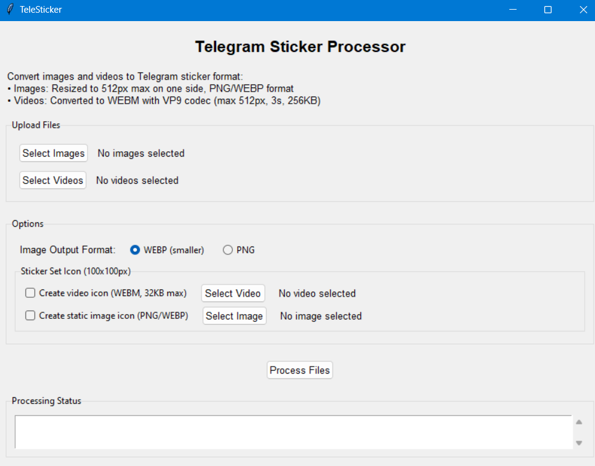

# TeleSticker

A desktop application that simplifies Telegram sticker creation by automatically formatting images and videos to meet Telegram's requirements. Process images to PNG/WEBP (512px), convert videos to WEBM (≤3s, ≤256KB), and create sticker set icons.



## Features

- Select multiple images (PNG, JPG, etc.) and videos (MP4, MOV, etc.)
- Process images:
  - Resize to 512 pixels on one side (Telegram requirement)
  - Convert to PNG or WEBP format
- Process videos:
  - Convert to WEBM with VP9 codec and alpha channel support
  - Resize to 512 pixels on one side
  - Ensure duration ≤ 3 seconds
  - Ensure file size ≤ 256 KB
  - Remove audio and enable looping
- Create sticker set icons:
  - Video icons (WEBM, 100x100px, 32KB max) for video sticker packs
  - Static image icons (PNG/WEBP, 100x100px) for image sticker packs
- Save all processed files to an output folder
- Simple and user-friendly desktop interface

## Requirements

- Python 3.8+
- FFmpeg installed on your system
- Required Python packages (installed via requirements.txt)

## Installation

1. Clone or download this repository

2. Install FFmpeg:
   - Windows: Download from [FFmpeg website](https://ffmpeg.org/download.html) and add to PATH
   - macOS: `brew install ffmpeg`
   - Linux: `sudo apt-get install ffmpeg`

3. Install Python dependencies:
   ```
   pip install -r requirements.txt
   ```

## Usage

1. Launch the application:
   - Run from command line: `python app.py`
   - For platform-specific launchers, see setup instructions above

2. Select images and/or videos using the respective buttons

3. Choose options:
   - Image format (PNG or WEBP)
   - Whether to create a video icon (for video sticker packs)
   - Whether to create a static image icon (for image sticker packs)

4. Click the "Process Files" button

5. Once processing is complete, click "Open Output Folder"

6. Upload each sticker to the [@Stickers](https://t.me/Stickers) bot on Telegram

## Telegram Sticker Requirements

### Image Stickers
- Format: PNG or WEBP
- Size: One side exactly 512px (the other side can be smaller)
- Must have transparent areas for better appearance

### Video Stickers
- Format: WEBM with VP9 codec
- Size: One side exactly 512px (the other side can be smaller)
- Duration: ≤ 3 seconds
- File size: ≤ 256 KB
- FPS: 30 fps
- No audio
- Should be looped for best experience

### Sticker Set Icons
- Static Icon (for image packs):
  - Format: PNG or WEBP
  - Size: Exactly 100x100px
- Video Icon (for video packs):
  - Format: WEBM with VP9 codec
  - Size: Exactly 100x100px
  - Duration: ≤ 3 seconds
  - File size: ≤ 32 KB
  - Must be looped

## Notes

- All processed files are stored in the `output` directory
- Video processing can take time, especially for higher quality videos
- You need to send each processed file to the @Stickers bot separately
- For setting a sticker set icon, use the `/setpackicon` command with the @Stickers bot

## Troubleshooting

- If you encounter permission issues, make sure FFmpeg is properly installed and accessible
- Ensure you're running Python from the application's directory
- For video processing issues, check that your FFmpeg installation supports VP9 codec

## License

MIT
